# Review packet: SYN-01-p4-r1 — Synthetic Arabic table (image, RTL)

**STATUS: PENDING** (not yet reviewed by a person). Units derived from this reading carry `reading.status = pending`.

| | |
|---|---|
| Source | SYN-01 page 4, bbox [80.0, 110.0, 500.0, 250.2] pt (PDF points) |
| Native image | 875x292 px, sha256 `0cc3c1a90be5e2ae53b4f5d1f58a7f2a95b4b58a79b971da093fc27f96fafa32` |
| Crop | `regions/SYN-01-p4-r1/crop.png` (200 dpi render), page context `regions/SYN-01-p4-r1/context.png` |
| Reading file | `build/fixture-src/readings/SYN-01-p4-r1.yaml` |
| Review subject sha256 | `a6f2e61aa44dda6fc63261c3f5b1d8d2dabc12a158c6004c15832959d44eabed` — an approval pins this value. It covers the reading (content, uncertainties, source claims, preparer, method) + evidence (source PDF sha256, region page/bbox/kind, native image sha256). |
| Prepared by | fixture generator: ground truth of what it drew (not a reading of pixels) |
| Method | cells copied from the builder's AR_ROWS; visual orders from UAX #9 reasoning |

## Checks run on this reading

| Check | Result | Detail |
|---|---|---|
| RD1 | pass | region SYN-01 p4 [80.0, 110.0, 500.0, 250.2]; reading says SYN-01 p4 [80.0, 110.0, 500.0, 250.2] |
| RD2 | pass | native image sha256 0cc3c1a90be5e2ae…; reading made from 0cc3c1a90be5e2ae… |
| RD8 | pass | 3 columns x 3 rows; 1 declared blank cells; every row has exactly one cell per column |
| RD3 | pass | grid from pixels: 5 horizontal x 4 vertical rules = 4 rows x 3 cols (skew -0.02 deg); reading: header + 3 rows x 3 columns |
| RD7 | pass | no text touches the image edge |
| RD4 | pass | 1 text bands and 0 rule bands detected; outside-grid text segments needing a reading: 0; unread: none |
| RD6 | pass | row noise cell item: numerals none; undeclared none |
| RD6 | pass | row noise cell limit: numerals ['45']; undeclared none |
| RD6 | pass | row noise cell limit: stored '45 dB(A)' -> rendered '45 dB(A)' found as a whole run in rendered glyph order '45 dB(A)'; crop shows '45 dB(A)' (left to right) |
| RD6 | pass | row noise cell note: numerals ['٢٢:٠٠-٠٦:٠٠']; undeclared none |
| RD6 | pass | row noise cell note: stored '٢٢:٠٠-٠٦:٠٠' -> rendered '٠٦:٠٠-٢٢:٠٠' found as a whole run in rendered glyph order '٠٦:٠٠-٢٢:٠٠ نم'; crop shows '٠٦:٠٠-٢٢:٠٠' (left to right) |
| RD6 | pass | row ph cell item: numerals none; undeclared none |
| RD6 | pass | row ph cell limit: numerals ['٦٫٠', '٩٫٠']; undeclared none |
| RD6 | pass | row ph cell limit: stored '٦٫٠ - ٩٫٠' -> rendered '٩٫٠ - ٦٫٠' found as a whole run in rendered glyph order '٩٫٠ - ٦٫٠'; crop shows '٩٫٠ - ٦٫٠' (left to right) |
| RD6 | pass | row ph cell note: numerals none; undeclared none |
| RD6 | pass | row samples cell item: numerals none; undeclared none |
| RD6 | pass | row samples cell limit: numerals ['١٢']; undeclared none |
| RD6 | pass | row samples cell limit: stored '١٢' -> rendered '١٢' found as a whole run in rendered glyph order '١٢'; crop shows '١٢' (left to right) |
| RD6 | pass | row samples cell note: numerals none; undeclared none |

All checks pass: **yes**.

## What the checks prove, and what they do not

They prove: the reading points at the detected region (RD1) and at the same image bytes (RD2); a table reading has the row and column count the pixels show (RD3) and exactly one cell per column, with blanks declared (RD8); every text band outside a table grid is covered by a reading line (RD4); Arabic is stored as logical letters with a separate translation (RD5); every numeral in Arabic text or Arabic/mixed cells is declared and the stored text, rendered right to left, puts its glyphs in the order the crop shows (RD6).

They do NOT prove: that any word, letter, mark, digit or value is the one printed; that a translation is right; what a value means (maximum, minimum, range, target); that nothing was cut off at the image edge. Those are your decisions. Passing checks never approve a reading.

## Points recorded for your decision

From the reading's recorded uncertainties; each is a question for you, not something the program decided.

1. Read every segment below against its crop and either approve the reading as a whole or correct the reading file (see the end of this packet).

## Numerals

Stored text is in logical order; the program renders it and compares the glyph order with what the crop shows. The glyph-shape comparison is advisory only.

- `row noise` cell `limit`: stored `45 dB(A)`, crop shows `45 dB(A)` (left to right). Render check: **PASS** (cell rendered right to left: '45 dB(A)' found as a whole run in rendered glyph order '45 dB(A)'). Meaning: fixture ground truth.
- `row noise` cell `note`: stored `٢٢:٠٠-٠٦:٠٠`, crop shows `٠٦:٠٠-٢٢:٠٠` (left to right). Render check: **PASS** (cell rendered right to left: '٠٦:٠٠-٢٢:٠٠' found as a whole run in rendered glyph order '٠٦:٠٠-٢٢:٠٠ نم'). Meaning: fixture ground truth.
- `row ph` cell `limit`: stored `٦٫٠ - ٩٫٠`, crop shows `٩٫٠ - ٦٫٠` (left to right). Render check: **PASS** (cell rendered right to left: '٩٫٠ - ٦٫٠' found as a whole run in rendered glyph order '٩٫٠ - ٦٫٠'). Meaning: fixture ground truth.
- `row samples` cell `limit`: stored `١٢`, crop shows `١٢` (left to right). Render check: **PASS** (cell rendered right to left: '١٢' found as a whole run in rendered glyph order '١٢'). Meaning: fixture ground truth.

## Side-by-side

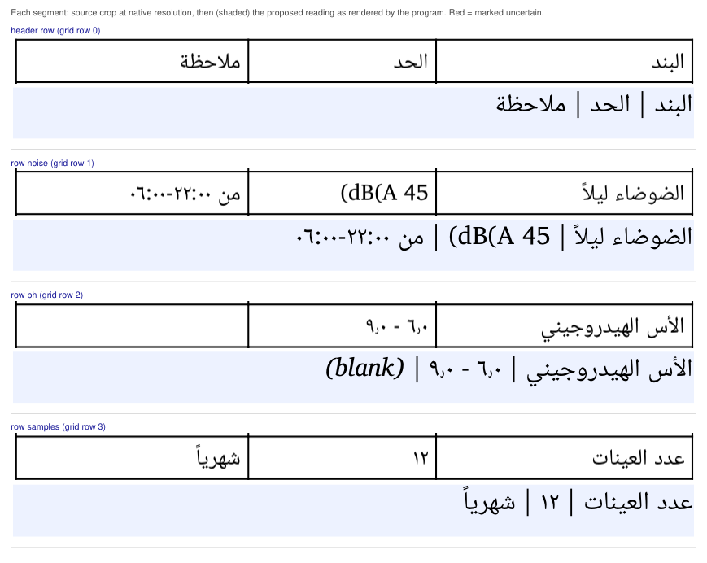

## Line by line (each crop beside its reading)

| Segment | Source crop | Proposed reading | Translation / notes |
|---|---|---|---|
| header row | 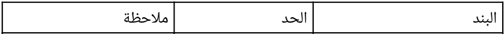 | البند \| الحد \| ملاحظة | table direction rtl: the first column is the rightmost on the page |
| &nbsp;&nbsp;heading `item` | 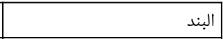 | البند | column language ar |
| &nbsp;&nbsp;heading `limit` | 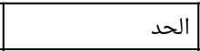 | الحد | column language mixed |
| &nbsp;&nbsp;heading `note` | 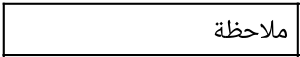 | ملاحظة | column language ar |
| row `noise` | 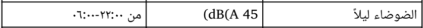 |  |  |
| &nbsp;&nbsp;`noise`.`item` | 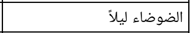 | الضوضاء ليلاً |  |
| &nbsp;&nbsp;`noise`.`limit` | 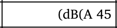 | 45 dB(A) | numeral `45 dB(A)` shows `45 dB(A)` left to right |
| &nbsp;&nbsp;`noise`.`note` | 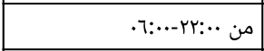 | من ٢٢:٠٠-٠٦:٠٠ | numeral `٢٢:٠٠-٠٦:٠٠` shows `٠٦:٠٠-٢٢:٠٠` left to right |
| row `ph` | 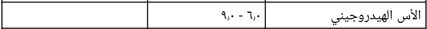 |  |  |
| &nbsp;&nbsp;`ph`.`item` | 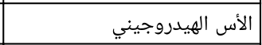 | الأس الهيدروجيني |  |
| &nbsp;&nbsp;`ph`.`limit` | 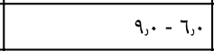 | ٦٫٠ - ٩٫٠ | numeral `٦٫٠ - ٩٫٠` shows `٩٫٠ - ٦٫٠` left to right |
| &nbsp;&nbsp;`ph`.`note` | 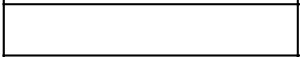 | *(blank, declared)* |  |
| row `samples` | 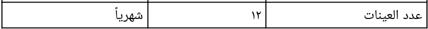 |  |  |
| &nbsp;&nbsp;`samples`.`item` | 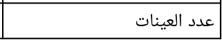 | عدد العينات |  |
| &nbsp;&nbsp;`samples`.`limit` | 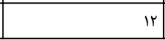 | ١٢ | numeral `١٢` shows `١٢` left to right |
| &nbsp;&nbsp;`samples`.`note` | 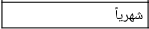 | شهرياً |  |

## How to approve or correct

1. Correct `build/fixture-src/readings/SYN-01-p4-r1.yaml` directly if anything is wrong, including adding or removing uncertainties.
2. When it is right, record your approval yourself: `python -m tenderpack approve SYN-01-p4-r1 --reviewer "Your Name"`. It refuses placeholder names, re-detects the region from the source PDF, re-runs the checks, and appends to `build/fixture-src/approvals.yaml` your name, today's date and the review subject sha256 above. The program never writes an approval by itself.
3. Re-run `python -m tenderpack ingest`. Any later change to the reading, its uncertainties, the source PDF, the region's position or the image makes the reading pending again.
