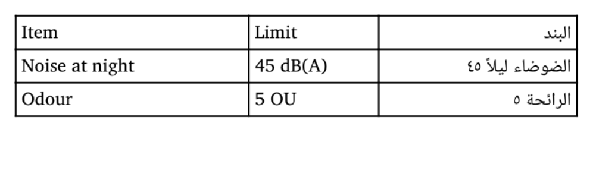

# Review packet: SYN-01-p4-r1 — NO READING

**STATUS: UNREAD.** This region has content outside the text layer and no reading exists. Nothing from it is in the units; coverage reports it as unread.

- Source: SYN-01 page 4, bbox [80.0, 110.0, 440.0, 220.4] pt; detected as `image` (embedded raster image (get_image_info))
- Crop: `regions/SYN-01-p4-r1/crop.png`

Text bands detected in the region: 1 (rule bands: 0).
