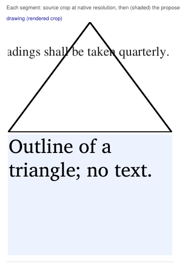
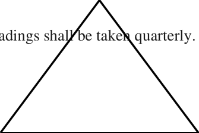

# Review packet: SYN-01-p4-r2 — Triangle drawn with straight lines

**STATUS: PENDING** (not yet reviewed by a person). Units derived from this reading carry `reading.status = pending`.

| | |
|---|---|
| Source | SYN-01 page 4, bbox [100.0, 250.0, 220.0, 330.0] pt (PDF points) |
| Native image | none (rendered crop) |
| Crop | `regions/SYN-01-p4-r2/crop.png` (200 dpi render), page context `regions/SYN-01-p4-r2/context.png` |
| Reading file | `build/fixture-src/readings/SYN-01-p4-r2.yaml` |
| Review subject sha256 | `09898b903511d3ba4a97ff35fd39fd7700b7a84dc2de5504bb8019479e344c17` — an approval pins this value. It covers the reading (content, uncertainties, source claims, preparer, method) + evidence (source PDF sha256, region page/bbox/kind, native image sha256). |
| Prepared by | fixture generator: ground truth of what it drew (not a reading of pixels) |
| Method | builder drew a closed three-segment polyline |

## Checks run on this reading

| Check | Result | Detail |
|---|---|---|
| RD1 | pass | region SYN-01 p4 [100.0, 250.0, 220.0, 330.0]; reading says SYN-01 p4 [100.0, 250.0, 220.0, 330.0] |
| RD9 | pass | graphic reading: description present; it records what the drawing shows and declares no text (a drawing with text needs a text or form reading) |

All checks pass: **yes**.

## What the checks prove, and what they do not

They prove: the reading points at the detected region (RD1) and at the same image bytes (RD2); a table reading has the row and column count the pixels show (RD3) and exactly one cell per column, with blanks declared (RD8); every text band outside a table grid is covered by a reading line (RD4); Arabic is stored as logical letters with a separate translation (RD5); every numeral in Arabic text or Arabic/mixed cells is declared and the stored text, rendered right to left, puts its glyphs in the order the crop shows (RD6).

They do NOT prove: that any word, letter, mark, digit or value is the one printed; that a translation is right; what a value means (maximum, minimum, range, target); that nothing was cut off at the image edge. Those are your decisions. Passing checks never approve a reading.

## Points recorded for your decision

From the reading's recorded uncertainties; each is a question for you, not something the program decided.

1. Read every segment below against its crop and either approve the reading as a whole or correct the reading file (see the end of this packet).

## Side-by-side

## Line by line (each crop beside its reading)

| Segment | Source crop | Proposed reading | Translation / notes |
|---|---|---|---|
| drawing |  | Outline of a triangle; no text. |  |

## How to approve or correct

1. Correct `build/fixture-src/readings/SYN-01-p4-r2.yaml` directly if anything is wrong, including adding or removing uncertainties.
2. When it is right, record your approval yourself: `python -m tenderpack approve SYN-01-p4-r2 --reviewer "Your Name"`. It refuses placeholder names, re-detects the region from the source PDF, re-runs the checks, and appends to `build/fixture-src/approvals.yaml` your name, today's date and the review subject sha256 above. The program never writes an approval by itself.
3. Re-run `python -m tenderpack ingest`. Any later change to the reading, its uncertainties, the source PDF, the region's position or the image makes the reading pending again.
