# Review packet: VOL-II-p3-r1 — Table 2-4 (image): Minimum Effluent Quality Parameters at the Point of Discharge

**STATUS: APPROVED** by Ahmad on 2026-10-03. Units derived from this reading carry `reading.status = approved`.

**Confirmation record:**

- worklog/2026-10-03_session-08_prompt.md, section 2 ('Record my source-reading confirmations'): the owner's written confirmation of 3 Oct 2026, received about 19:30 UTC; recorded by the assistant (Claude Code) on that instruction. The confirmation was made on the reading as shown in the session 07 review packets (reading file unchanged since commit 1997ef8)

**Confirms:**

- Confirms the visible Table 2-4 transcription: rows, headings, units, limits, assessment bases and the visible note (Note 1). TN = 5 mg/l is the original reading; 3 mg/l is the separate amended value (ADD-02 5.1).

**Settled by the reviewer:**

- the printed qualifier is confirmed as read: '(all values are maxima; compliance assessed as a 30-day rolling average unless stated)'
- the limits are confirmed as read, including Faecal Coliforms 2.2 MPN/100 ml (the decimal-point question in the reading is settled by this confirmation of the visible limits)

**Left open:**

- how the 'all values are maxima' qualifier interacts with the Residual Chlorine (0.5 - 1.0 mg/l) and pH (6.0 - 9.0) ranges is unresolved
- each parameter keeps its own printed basis of assessment (30-day rolling average, maximum instantaneous, maximum any single sample, continuous at outlet); the qualifier's default applies only 'unless stated'
- anything outside the visible image stays uncertain (e.g. whether a further note was cut off below Note 1)
- register, not part of the reading: VOL-V 29.3's first-12-month availability-deduction exception for rolling-average parameters is retained; it is not an exemption from technical compliance or commissioning requirements

**Does not cover:**

- changed or unseen content: any later change to the reading, its uncertainties or its evidence makes it pending again; differences are shown before any approval is extended
- the register's interpretations of this content (A1 rows stay proposed until decided row by row)
- amendment operations (e.g. ADD-02/5.1, TN 5 -> 3 mg/l, stays proposed)
- bidder compliance

**Environmental Permit:**

- confirmed: the location of the precedence language only: it is in the VOL-II p3 reproduction preamble (text layer, unit VOL-II:T2-4-heading/para1, printed above the image, so outside this reading): 'In the event of any discrepancy between this reproduction and the Environmental Permit, the Environmental Permit shall prevail.'
- not confirmed: the contents of the Environmental Permit, which is not in the pack; compliance with the Environmental Permit, which is not claimed, including after the TN amendment (ADD-02 5.1)

**Record amended:**

- 3 Oct 2026, by the assistant, from the owner's follow-up message (worklog/2026-10-03_session-08_prompt.md, follow-up): the permit wording was split into what the owner's confirmation covers (the location of the precedence language) and what it does not (the Permit's contents, Permit compliance). Reviewer, date and review subject unchanged.

| | |
|---|---|
| Source | VOL-II page 3, bbox [56.7, 143.2, 538.6, 446.1] pt (PDF points) |
| Native image | 1750x1100 px, sha256 `27373c58a989d8ddc62ac537efca5551184ed992ae34ee3cc0b4fb33ff3acec6` |
| Crop | `regions/VOL-II-p3-r1/crop.png` (200 dpi render), page context `regions/VOL-II-p3-r1/context.png` |
| Reading file | `curation/readings/VOL-II-p3-r1.yaml` |
| Review subject sha256 | `6bc6505956429dc7fef21c829905f5e0177568e81a74481593d324460101f012` — an approval pins this value. It covers the reading (content, uncertainties, source claims, preparer, method) + evidence (source PDF sha256, region page/bbox/kind, native image sha256). |
| Prepared by | AI-assisted: Claude Code session 02 (2026-10-02), read visually from the native 1750x1100 px image |
| Method | Visual reading of the embedded image at native resolution. No OCR. Grid structure (rows, columns) measured from pixels by tenderpack.regions.detect_grid; band positions by text_bands. |

## Checks run on this reading

| Check | Result | Detail |
|---|---|---|
| RD1 | pass | region VOL-II p3 [56.7, 143.2, 538.6, 446.1]; reading says VOL-II p3 [56.7, 143.2, 538.6, 446.1] |
| RD2 | pass | native image sha256 27373c58a989d8dd…; reading made from 27373c58a989d8dd… |
| RD8 | pass | 4 columns x 10 rows; 0 declared blank cells; every row has exactly one cell per column |
| RD3 | pass | grid from pixels: 12 horizontal x 5 vertical rules = 11 rows x 4 cols (skew -0.34 deg); reading: header + 10 rows x 4 columns |
| RD7 | WARNING | text bands [24] touch the image edge (1750x1100 px): content may continue beyond the image; cannot be established from the pack |
| RD4 | pass | 14 text bands and 11 rule bands detected; outside-grid text segments needing a reading: 3; unread: none |

All checks pass: **yes**.

## What the checks prove, and what they do not

They prove: the reading points at the detected region (RD1) and at the same image bytes (RD2); a table reading has the row and column count the pixels show (RD3) and exactly one cell per column, with blanks declared (RD8); every text band outside a table grid is covered by a reading line (RD4); Arabic is stored as logical letters with a separate translation (RD5); every numeral in Arabic text or Arabic/mixed cells is declared and the stored text, rendered right to left, puts its glyphs in the order the crop shows (RD6).

They do NOT prove: that any word, letter, mark, digit or value is the one printed; that a translation is right; what a value means (maximum, minimum, range, target); that nothing was cut off at the image edge (RD7 warns that it may have been). Those are your decisions. Passing checks never approve a reading.

## Points recorded for your decision

From the reading's recorded uncertainties; each is a question for you, not something the program decided.

1. The table is a scan with speckle and a measured skew of about -0.34 degrees; values were read at native resolution.
2. Table 2-4 is stated to be reproduced from an Environmental Permit that is not in the pack; this reading says what the image shows, nothing about the Permit.
3. `note1`: Note 1 is the last line of the image and touches its bottom edge; the image may be cropped. The page continues with 'End of reproduction.' in the text layer, but whether a further note was cut off cannot be established from the pack.
4. row `FaecalColiforms`: decimal point in 2.2: clear at native resolution, but a speckled scan can imitate a point; reviewer to confirm — settled by Ahmad 2026-10-03: the limits are confirmed as read, including Faecal Coliforms 2.2 MPN/100 ml (the decimal-point question in the reading is settled by this confirmation of the visible limits)
5. row `ResidualChlorine`: printed as a range although the qualifier says 'all values are maxima'; whether 0.5 is a binding minimum is an interpretation for a person, not a reading question
6. row `pH`: unit cell shows a dash, read as 'no unit'
7. row `pH`: range printed under a 'maxima' qualifier (see Residual Chlorine)
8. Read every segment below against its crop and either approve the reading as a whole or correct the reading file (see the end of this packet).

## Side-by-side

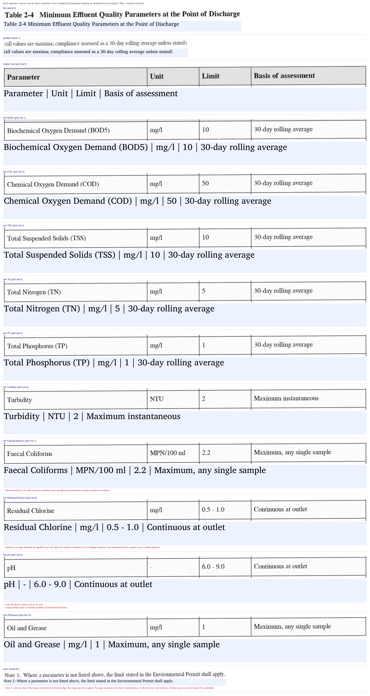

## Line by line (each crop beside its reading)

| Segment | Source crop | Proposed reading | Translation / notes |
|---|---|---|---|
| header row | 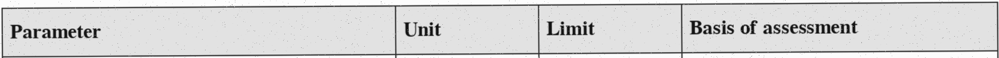 | Parameter \| Unit \| Limit \| Basis of assessment | table direction ltr |
| &nbsp;&nbsp;heading `parameter` |  | Parameter | column language en |
| &nbsp;&nbsp;heading `unit` | 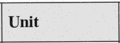 | Unit | column language en |
| &nbsp;&nbsp;heading `limit` | 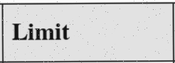 | Limit | column language en |
| &nbsp;&nbsp;heading `basis` | 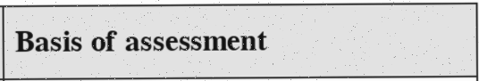 | Basis of assessment | column language en |
| row `BOD5` | 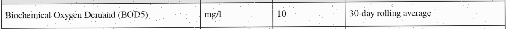 |  |  |
| &nbsp;&nbsp;`BOD5`.`parameter` | 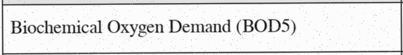 | Biochemical Oxygen Demand (BOD5) |  |
| &nbsp;&nbsp;`BOD5`.`unit` | 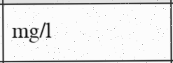 | mg/l |  |
| &nbsp;&nbsp;`BOD5`.`limit` | 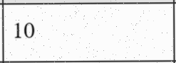 | 10 |  |
| &nbsp;&nbsp;`BOD5`.`basis` | 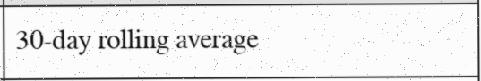 | 30-day rolling average |  |
| row `COD` | 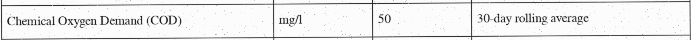 |  |  |
| &nbsp;&nbsp;`COD`.`parameter` | 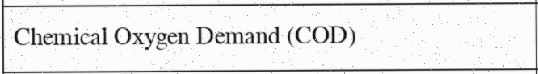 | Chemical Oxygen Demand (COD) |  |
| &nbsp;&nbsp;`COD`.`unit` |  | mg/l |  |
| &nbsp;&nbsp;`COD`.`limit` | 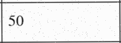 | 50 |  |
| &nbsp;&nbsp;`COD`.`basis` | 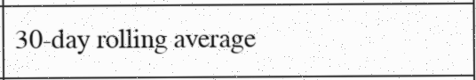 | 30-day rolling average |  |
| row `TSS` | 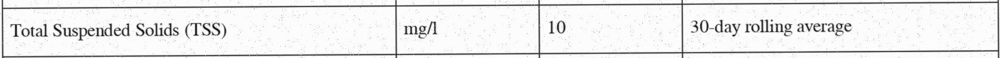 |  |  |
| &nbsp;&nbsp;`TSS`.`parameter` | 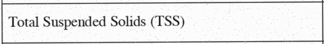 | Total Suspended Solids (TSS) |  |
| &nbsp;&nbsp;`TSS`.`unit` | 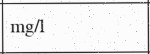 | mg/l |  |
| &nbsp;&nbsp;`TSS`.`limit` | 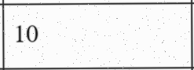 | 10 |  |
| &nbsp;&nbsp;`TSS`.`basis` |  | 30-day rolling average |  |
| row `TN` | 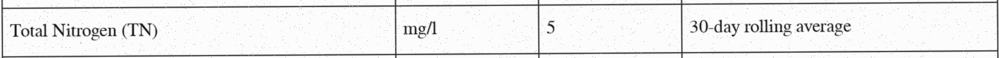 |  |  |
| &nbsp;&nbsp;`TN`.`parameter` | 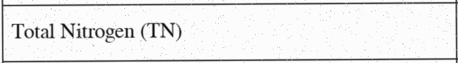 | Total Nitrogen (TN) |  |
| &nbsp;&nbsp;`TN`.`unit` |  | mg/l |  |
| &nbsp;&nbsp;`TN`.`limit` | 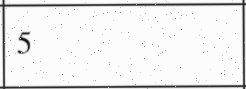 | 5 |  |
| &nbsp;&nbsp;`TN`.`basis` | 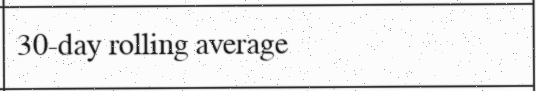 | 30-day rolling average |  |
| row `TP` | 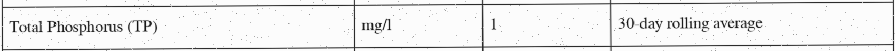 |  |  |
| &nbsp;&nbsp;`TP`.`parameter` | 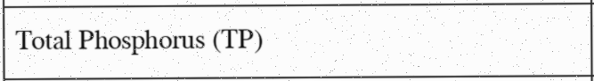 | Total Phosphorus (TP) |  |
| &nbsp;&nbsp;`TP`.`unit` |  | mg/l |  |
| &nbsp;&nbsp;`TP`.`limit` | 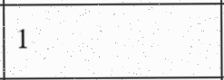 | 1 |  |
| &nbsp;&nbsp;`TP`.`basis` |  | 30-day rolling average |  |
| row `Turbidity` | 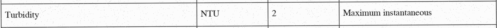 |  |  |
| &nbsp;&nbsp;`Turbidity`.`parameter` | 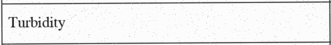 | Turbidity |  |
| &nbsp;&nbsp;`Turbidity`.`unit` | 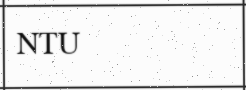 | NTU |  |
| &nbsp;&nbsp;`Turbidity`.`limit` | 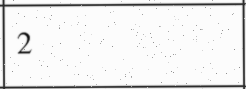 | 2 |  |
| &nbsp;&nbsp;`Turbidity`.`basis` | 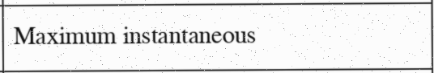 | Maximum instantaneous |  |
| row `FaecalColiforms` | 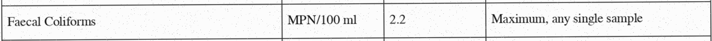 |  | decimal point in 2.2: clear at native resolution, but a speckled scan can imitate a point; reviewer to confirm |
| &nbsp;&nbsp;`FaecalColiforms`.`parameter` | 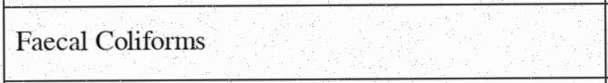 | Faecal Coliforms |  |
| &nbsp;&nbsp;`FaecalColiforms`.`unit` | 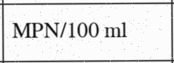 | MPN/100 ml |  |
| &nbsp;&nbsp;`FaecalColiforms`.`limit` | 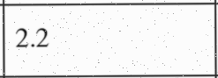 | 2.2 |  |
| &nbsp;&nbsp;`FaecalColiforms`.`basis` |  | Maximum, any single sample |  |
| row `ResidualChlorine` | 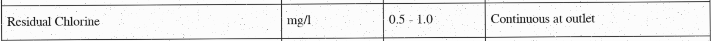 |  | printed as a range although the qualifier says 'all values are maxima'; whether 0.5 is a binding minimum is an interpretation for a person, not a reading question |
| &nbsp;&nbsp;`ResidualChlorine`.`parameter` | 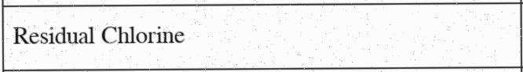 | Residual Chlorine |  |
| &nbsp;&nbsp;`ResidualChlorine`.`unit` |  | mg/l |  |
| &nbsp;&nbsp;`ResidualChlorine`.`limit` | 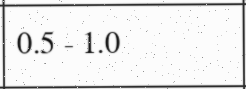 | 0.5 - 1.0 |  |
| &nbsp;&nbsp;`ResidualChlorine`.`basis` | 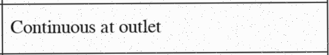 | Continuous at outlet |  |
| row `pH` | 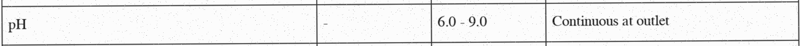 |  | unit cell shows a dash, read as 'no unit'; range printed under a 'maxima' qualifier (see Residual Chlorine) |
| &nbsp;&nbsp;`pH`.`parameter` | 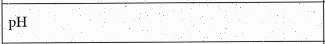 | pH |  |
| &nbsp;&nbsp;`pH`.`unit` | 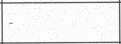 | - |  |
| &nbsp;&nbsp;`pH`.`limit` | 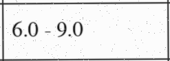 | 6.0 - 9.0 |  |
| &nbsp;&nbsp;`pH`.`basis` | 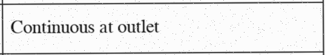 | Continuous at outlet |  |
| row `OilGrease` | 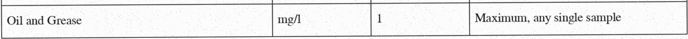 |  |  |
| &nbsp;&nbsp;`OilGrease`.`parameter` | 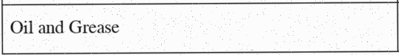 | Oil and Grease |  |
| &nbsp;&nbsp;`OilGrease`.`unit` |  | mg/l |  |
| &nbsp;&nbsp;`OilGrease`.`limit` | 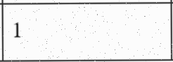 | 1 |  |
| &nbsp;&nbsp;`OilGrease`.`basis` | 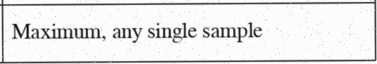 | Maximum, any single sample |  |
| `title` band 0 full |  | Table 2-4   Minimum Effluent Quality Parameters at the Point of Discharge |  |
| `qualifier` band 1 full | 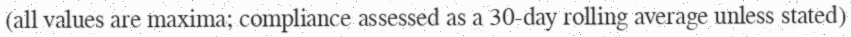 | (all values are maxima; compliance assessed as a 30-day rolling average unless stated) |  |
| `note1` band 24 full | 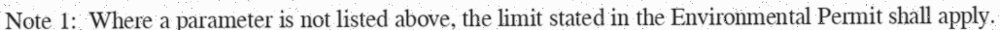 | Note 1:  Where a parameter is not listed above, the limit stated in the Environmental Permit shall apply. |  |

## How to approve or correct

1. Correct `curation/readings/VOL-II-p3-r1.yaml` directly if anything is wrong, including adding or removing uncertainties.
2. When it is right, record your approval yourself: `python -m tenderpack approve VOL-II-p3-r1 --reviewer "Your Name"`. It refuses placeholder names, re-detects the region from the source PDF, re-runs the checks, and appends to `curation/approvals.yaml` your name, today's date and the review subject sha256 above. The program never writes an approval by itself.
3. Re-run `python -m tenderpack ingest`. Any later change to the reading, its uncertainties, the source PDF, the region's position or the image makes the reading pending again.
