# Review packet: VOL-IV-p6-r1 — Form 4-C (image, Arabic with English labels): Conflict of Interest and Debarment Declaration

**STATUS: APPROVED** by Ahmad on 2026-10-03. Units derived from this reading carry `reading.status = approved`.

**Confirmation record:**

- worklog/2026-10-03_session-08_prompt.md, section 2 ('Record my source-reading confirmations'): the owner's written confirmation of 3 Oct 2026, received about 19:30 UTC; recorded by the assistant (Claude Code) on that instruction. The confirmation was made on the reading as shown in the session 07 review packets (reading file unchanged since commit 1997ef8)

**Confirms:**

- Confirms the visible Arabic text and the displayed translations of the Form 4-C reading, including the headings, declarations, fields and footer.

**Settled by the reviewer:**

- Declaration 5 (خامساً) refers to Volume I clause 4.2 (البند ٤-٢): the reviewer settles the uncertain left glyph of the clause numeral as ٢; the alternative recorded in the reading (٤-٣, VOL-I 4.3) is set aside by the reviewer

**Left open:**

- the exact placement of diacritics (tanween on the ordinal words and كاملاً, hamza forms) stays uncertain, as recorded in the reading
- 'exclusion of the proposal' (استبعاد العرض, declaration 4) is not automatically equivalent to every other consequence category of the pack (rejection, disqualification, non-responsiveness); how it maps stays for a person to decide

**Does not cover:**

- changed or unseen content: any later change to the reading, its uncertainties or its evidence makes it pending again; differences are shown before any approval is extended
- the register's interpretations of this content (A1 rows stay proposed until decided row by row)
- amendment operations
- bidder compliance

| | |
|---|---|
| Source | VOL-IV page 6, bbox [66.6, 68.4, 528.7, 721.8] pt (PDF points) |
| Native image | 1654x2339 px, sha256 `521e024a9cc624d8669d12300f97f1b653375029b1af5963ea39f922a673f6ff` |
| Crop | `regions/VOL-IV-p6-r1/crop.png` (200 dpi render), page context `regions/VOL-IV-p6-r1/context.png` |
| Reading file | `curation/readings/VOL-IV-p6-r1.yaml` |
| Review subject sha256 | `f433c2ca4e56267920ad7819090469185ae2b28ac9dc5d52ee04390fec934247` — an approval pins this value. It covers the reading (content, uncertainties, source claims, preparer, method) + evidence (source PDF sha256, region page/bbox/kind, native image sha256). |
| Prepared by | AI-assisted: Claude Code session 02 (2026-10-02), read visually from the native 1654x2339 px image; disputed marks re-checked on native pixels |
| Method | Visual reading of the embedded image. No OCR. Text bands, rule bands and left/right splits measured from pixels by tenderpack.regions.text_bands. Digit glyphs in the clause reference compared against Noto Naskh Arabic renders (advisory only). |

## Checks run on this reading

| Check | Result | Detail |
|---|---|---|
| RD1 | pass | region VOL-IV p6 [66.6, 68.4, 528.7, 721.8]; reading says VOL-IV p6 [66.6, 68.4, 528.7, 721.8] |
| RD2 | pass | native image sha256 521e024a9cc624d8…; reading made from 521e024a9cc624d8… |
| RD7 | pass | no text touches the image edge |
| RD4 | pass | 23 text bands and 9 rule bands detected; outside-grid text segments needing a reading: 32; unread: none |
| RD5 | pass | hdr-ar: translation present (stored separately from source) |
| RD5 | pass | hdr-ar band 1: stored as logical Unicode Arabic letters |
| RD6 | pass | hdr-ar band 1: numerals in source none; undeclared none |
| RD5 | pass | ref-ar: translation present (stored separately from source) |
| RD5 | pass | ref-ar band 2: stored as logical Unicode Arabic letters |
| RD6 | pass | ref-ar band 2: numerals in source ['2026/014']; undeclared none |
| RD6 | pass | ref-ar band 2: stored '2026/014' -> rendered '2026/014' found as a whole run in rendered glyph order 'NUPA/ISTP/2026/014 :مقر ةصقانم'; crop shows '2026/014' (left to right) |
| RD5 | pass | form-ar: translation present (stored separately from source) |
| RD5 | pass | form-ar band 4: stored as logical Unicode Arabic letters |
| RD6 | pass | form-ar band 4: numerals in source ['٤']; undeclared none |
| RD6 | pass | form-ar band 4: stored '٤-ج' -> rendered 'ج-٤' found as a whole run in rendered glyph order 'ج-٤ جذومنDŽا'; crop shows 'ج-٤' (left to right) |
| RD5 | pass | title: translation present (stored separately from source) |
| RD5 | pass | title band 5: stored as logical Unicode Arabic letters |
| RD6 | pass | title band 5: numerals in source none; undeclared none |
| RD5 | pass | intro: translation present (stored separately from source) |
| RD5 | pass | intro band 6: stored as logical Unicode Arabic letters |
| RD6 | pass | intro band 6: numerals in source none; undeclared none |
| RD5 | pass | intro band 7: stored as logical Unicode Arabic letters |
| RD6 | pass | intro band 7: numerals in source none; undeclared none |
| RD5 | pass | decl1: translation present (stored separately from source) |
| RD5 | pass | decl1 band 8: stored as logical Unicode Arabic letters |
| RD6 | pass | decl1 band 8: numerals in source none; undeclared none |
| RD5 | pass | decl1 band 9: stored as logical Unicode Arabic letters |
| RD6 | pass | decl1 band 9: numerals in source none; undeclared none |
| RD5 | pass | decl2: translation present (stored separately from source) |
| RD5 | pass | decl2 band 10: stored as logical Unicode Arabic letters |
| RD6 | pass | decl2 band 10: numerals in source none; undeclared none |
| RD5 | pass | decl3: translation present (stored separately from source) |
| RD5 | pass | decl3 band 11: stored as logical Unicode Arabic letters |
| RD6 | pass | decl3 band 11: numerals in source none; undeclared none |
| RD5 | pass | decl3 band 12: stored as logical Unicode Arabic letters |
| RD6 | pass | decl3 band 12: numerals in source none; undeclared none |
| RD5 | pass | decl4: translation present (stored separately from source) |
| RD5 | pass | decl4 band 13: stored as logical Unicode Arabic letters |
| RD6 | pass | decl4 band 13: numerals in source none; undeclared none |
| RD5 | pass | decl4 band 14: stored as logical Unicode Arabic letters |
| RD6 | pass | decl4 band 14: numerals in source none; undeclared none |
| RD5 | pass | decl5: translation present (stored separately from source) |
| RD5 | pass | decl5 band 15: stored as logical Unicode Arabic letters |
| RD6 | pass | decl5 band 15: numerals in source ['٤-٢']; undeclared none |
| RD6 | pass | decl5 band 15: stored '٤-٢' -> rendered '٢-٤' found as a whole run in rendered glyph order '.لو ƾا دǁجمDŽا نم ٢-٤ دنبDŽا يف اهيǁع صوصنمDŽا لاصتƾا دعاوقب مزتǁن :اًسماخ'; crop shows '٢-٤' (left to right) |
| RD5 | pass | field-member-ar: translation present (stored separately from source) |
| RD5 | pass | field-member-ar band 17: stored as logical Unicode Arabic letters |
| RD6 | pass | field-member-ar band 17: numerals in source none; undeclared none |
| RD5 | pass | field-cr-ar: translation present (stored separately from source) |
| RD5 | pass | field-cr-ar band 19: stored as logical Unicode Arabic letters |
| RD6 | pass | field-cr-ar band 19: numerals in source none; undeclared none |
| RD5 | pass | field-signatory-ar: translation present (stored separately from source) |
| RD5 | pass | field-signatory-ar band 21: stored as logical Unicode Arabic letters |
| RD6 | pass | field-signatory-ar band 21: numerals in source none; undeclared none |
| RD5 | pass | field-capacity-ar: translation present (stored separately from source) |
| RD5 | pass | field-capacity-ar band 23: stored as logical Unicode Arabic letters |
| RD6 | pass | field-capacity-ar band 23: numerals in source none; undeclared none |
| RD5 | pass | field-date-ar: translation present (stored separately from source) |
| RD5 | pass | field-date-ar band 25: stored as logical Unicode Arabic letters |
| RD6 | pass | field-date-ar band 25: numerals in source none; undeclared none |
| RD5 | pass | field-signature-ar: translation present (stored separately from source) |
| RD5 | pass | field-signature-ar band 27: stored as logical Unicode Arabic letters |
| RD6 | pass | field-signature-ar band 27: numerals in source none; undeclared none |
| RD5 | pass | note: translation present (stored separately from source) |
| RD5 | pass | note band 29: stored as logical Unicode Arabic letters |
| RD6 | pass | note band 29: numerals in source none; undeclared none |
| RD5 | pass | note band 30: stored as logical Unicode Arabic letters |
| RD6 | pass | note band 30: numerals in source none; undeclared none |

All checks pass: **yes**.

## What the checks prove, and what they do not

They prove: the reading points at the detected region (RD1) and at the same image bytes (RD2); a table reading has the row and column count the pixels show (RD3) and exactly one cell per column, with blanks declared (RD8); every text band outside a table grid is covered by a reading line (RD4); Arabic is stored as logical letters with a separate translation (RD5); every numeral in Arabic text or Arabic/mixed cells is declared and the stored text, rendered right to left, puts its glyphs in the order the crop shows (RD6).

They do NOT prove: that any word, letter, mark, digit or value is the one printed; that a translation is right; what a value means (maximum, minimum, range, target); that nothing was cut off at the image edge. Those are your decisions. Passing checks never approve a reading.

## Points recorded for your decision

From the reading's recorded uncertainties; each is a question for you, not something the program decided.

1. Diacritics (tanween on أولاً, ثانياً, ثالثاً, رابعاً, خامساً, كاملاً; hamza forms) were checked on native pixels; at reduced zoom they disappear, so review the native crops, not a scaled view.
2. Where printed tanween sits relative to the final alef is not visible; it is stored after the alef. Matching text removes tashkeel, so this does not affect matching.
3. Blank fill-in lines under each field label are rule bands (structure), not text.
4. `decl4`: translation of استبعاد العرض as 'exclusion of the proposal': the English text of the pack never uses 'exclusion'; how it maps to the pack's rejection / disqualification / non-responsiveness categories is for a person to decide
5. `decl5` numeral `٤-٢`: Order is settled: the crop shows the hyphenated pair left to right as [digit]-[٤], which is what logical 4-x renders as. Identity of the left digit is not settled by machine: shape (chamfer) comparison favours ٢ over ٣ at three thresholds, a template-overlap score favoured ٣, and the preparer's visual comparison favours ٢. Reviewer to read the crop. — settled by Ahmad 2026-10-03: Declaration 5 (خامساً) refers to Volume I clause 4.2 (البند ٤-٢): the reviewer settles the uncertain left glyph of the clause numeral as ٢; the alternative recorded in the reading (٤-٣, VOL-I 4.3) is set aside by the reviewer
6. Read every segment below against its crop and either approve the reading as a whole or correct the reading file (see the end of this packet).

## Numerals

Stored text is in logical order; the program renders it and compares the glyph order with what the crop shows. The glyph-shape comparison is advisory only.

- `ref-ar` band 2: stored `2026/014`, crop shows `2026/014` (left to right). Render check: **PASS** ('2026/014' found as a whole run in rendered glyph order 'NUPA/ISTP/2026/014 :مقر ةصقانم'). Meaning: digits of the tender reference (Latin script run inside Arabic text).
- `form-ar` band 4: stored `٤-ج`, crop shows `ج-٤` (left to right). Render check: **PASS** ('ج-٤' found as a whole run in rendered glyph order 'ج-٤ جذومنDŽا'). Meaning: Form 4-C (the Arabic letter ج is used for C).
  - glyph-shape advisory, left to right: ٥ (best ٥ 0.0416, next ٨ 0.0605, margin 0.312), ٠ (best ٠ 0.2055, next ٧ 0.276, margin 0.255), ٤ (best ٤ 0.0191, next ١ 0.0487, margin 0.608), ٥ (best ٥ 0.0378, next ٨ 0.061, margin 0.381)
  - 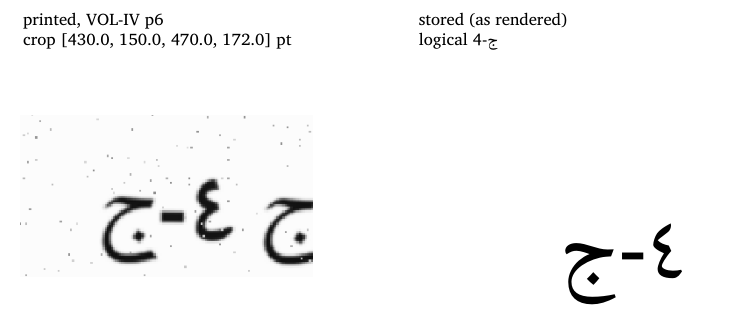
- `decl5` band 15: stored `٤-٢`, crop shows `٢-٤` (left to right). Render check: **PASS** ('٢-٤' found as a whole run in rendered glyph order '.لو ƾا دǁجمDŽا نم ٢-٤ دنبDŽا يف اهيǁع صوصنمDŽا لاصتƾا دعاوقب مزتǁن :اًسماخ'). Meaning: Clause 4-2 of Volume I, i.e. VOL-I §4.2 (blackout; 'Communications and Blackout' section). **Uncertain.** Alternatives: ٤-٣, i.e. VOL-I §4.3 (single point of contact), if the left glyph is ٣ rather than ٢
  - glyph-shape advisory, left to right: ٢ (best ٢ 0.0153, next ٣ 0.0181, margin 0.156, LOW), -, ٤ (best ٤ 0.0184, next ١ 0.0487, margin 0.622)
  - 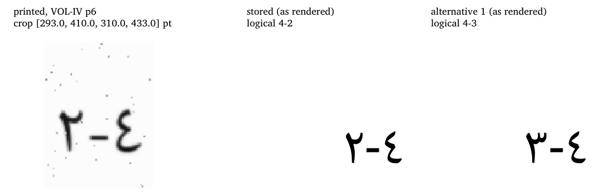

## Side-by-side

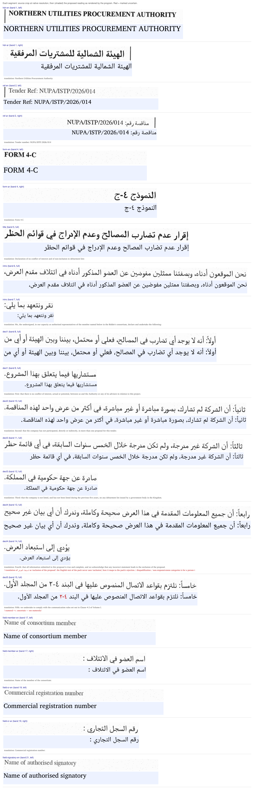
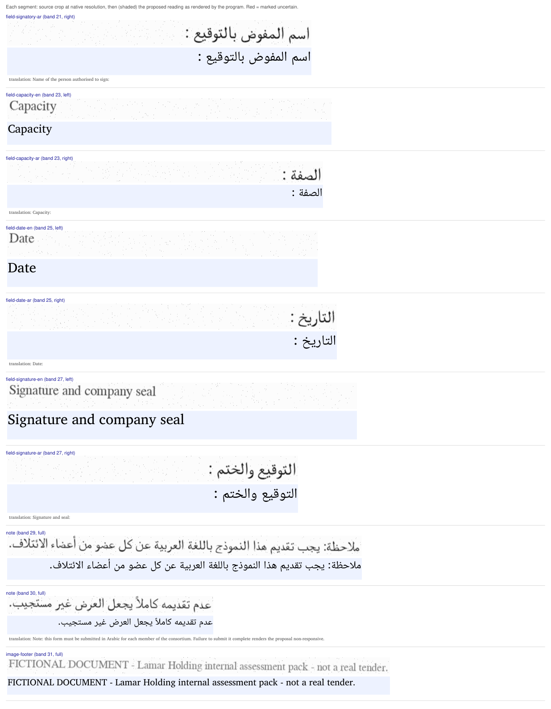

## Line by line (each crop beside its reading)

| Segment | Source crop | Proposed reading | Translation / notes |
|---|---|---|---|
| `hdr-en` band 1 left |  | NORTHERN UTILITIES PROCUREMENT AUTHORITY |  |
| `hdr-ar` band 1 right | 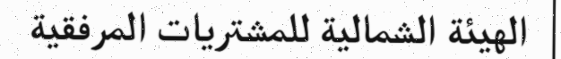 | الهيئة الشمالية للمشتريات المرفقية | Northern Utilities Procurement Authority |
| `ref-en` band 2 left | 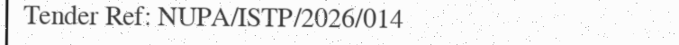 | Tender Ref: NUPA/ISTP/2026/014 |  |
| `ref-ar` band 2 right | 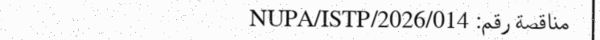 | مناقصة رقم: NUPA/ISTP/2026/014 | Tender number: NUPA/ISTP/2026/014 |
| `form-en` band 4 left |  | FORM 4-C |  |
| `form-ar` band 4 right |  | النموذج ٤-ج | Form 4-C |
| `title` band 5 full | 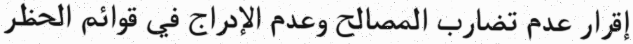 | إقرار عدم تضارب المصالح وعدم الإدراج في قوائم الحظر | Declaration of no conflict of interest and of non-inclusion in debarment lists |
| `intro` band 6 full | 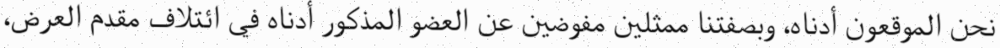 | نحن الموقعون أدناه، وبصفتنا ممثلين مفوضين عن العضو المذكور أدناه في ائتلاف مقدم العرض، | We, the undersigned, in our capacity as authorised representatives of the member named below in the Bidder's consortium, declare and undertake the following: |
| `intro` band 7 full | 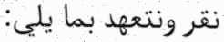 | نقر ونتعهد بما يلي: | We, the undersigned, in our capacity as authorised representatives of the member named below in the Bidder's consortium, declare and undertake the following: |
| `decl1` band 8 full | 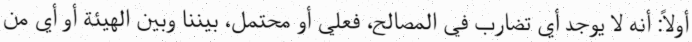 | أولاً: أنه لا يوجد أي تضارب في المصالح، فعلي أو محتمل، بيننا وبين الهيئة أو أي من | First: that there is no conflict of interest, actual or potential, between us and the Authority or any of its advisers in relation to this project. |
| `decl1` band 9 full | 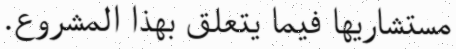 | مستشاريها فيما يتعلق بهذا المشروع. | First: that there is no conflict of interest, actual or potential, between us and the Authority or any of its advisers in relation to this project. |
| `decl2` band 10 full | 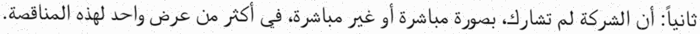 | ثانياً: أن الشركة لم تشارك، بصورة مباشرة أو غير مباشرة، في أكثر من عرض واحد لهذه المناقصة. | Second: that the company has not participated, directly or indirectly, in more than one proposal for this tender. |
| `decl3` band 11 full | 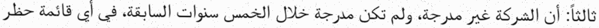 | ثالثاً: أن الشركة غير مدرجة، ولم تكن مدرجة خلال الخمس سنوات السابقة، في أي قائمة حظر | Third: that the company is not listed, and has not been listed during the previous five years, on any debarment list issued by a government body in the Kingdom. |
| `decl3` band 12 full | 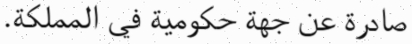 | صادرة عن جهة حكومية في المملكة. | Third: that the company is not listed, and has not been listed during the previous five years, on any debarment list issued by a government body in the Kingdom. |
| `decl4` band 13 full | 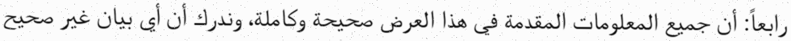 | رابعاً: أن جميع المعلومات المقدمة في هذا العرض صحيحة وكاملة، وندرك أن أي بيان غير صحيح | Fourth: that all information submitted in this proposal is true and complete, and we acknowledge that any incorrect statement leads to the exclusion of the proposal. |
| `decl4` band 14 full | 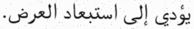 | يؤدي إلى استبعاد العرض. | Fourth: that all information submitted in this proposal is true and complete, and we acknowledge that any incorrect statement leads to the exclusion of the proposal. |
| `decl5` band 15 full | 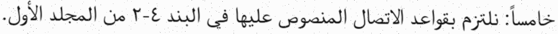 | خامساً: نلتزم بقواعد الاتصال المنصوص عليها في البند ٤-٢ من المجلد الأول. | Fifth: we undertake to comply with the communication rules set out in Clause 4-2 of Volume I. |
| `field-member-en` band 17 left | 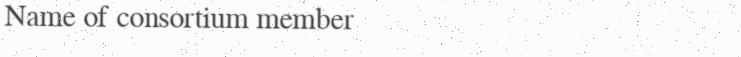 | Name of consortium member |  |
| `field-member-ar` band 17 right | 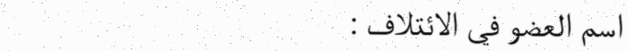 | اسم العضو في الائتلاف : | Name of the member of the consortium: |
| `field-cr-en` band 19 left | 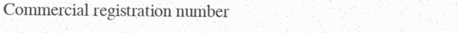 | Commercial registration number |  |
| `field-cr-ar` band 19 right | 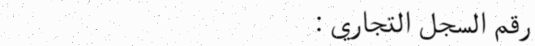 | رقم السجل التجاري : | Commercial registration number: |
| `field-signatory-en` band 21 left |  | Name of authorised signatory |  |
| `field-signatory-ar` band 21 right | 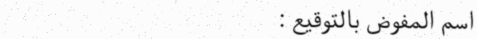 | اسم المفوض بالتوقيع : | Name of the person authorised to sign: |
| `field-capacity-en` band 23 left |  | Capacity |  |
| `field-capacity-ar` band 23 right | 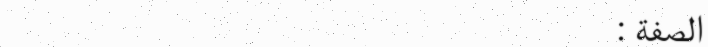 | الصفة : | Capacity: |
| `field-date-en` band 25 left |  | Date |  |
| `field-date-ar` band 25 right | 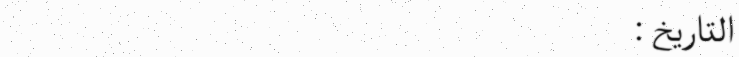 | التاريخ : | Date: |
| `field-signature-en` band 27 left |  | Signature and company seal |  |
| `field-signature-ar` band 27 right | 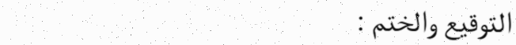 | التوقيع والختم : | Signature and seal: |
| `note` band 29 full | 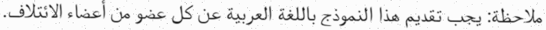 | ملاحظة: يجب تقديم هذا النموذج باللغة العربية عن كل عضو من أعضاء الائتلاف. | Note: this form must be submitted in Arabic for each member of the consortium. Failure to submit it complete renders the proposal non-responsive. |
| `note` band 30 full | 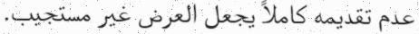 | عدم تقديمه كاملاً يجعل العرض غير مستجيب. | Note: this form must be submitted in Arabic for each member of the consortium. Failure to submit it complete renders the proposal non-responsive. |
| `image-footer` band 31 full | 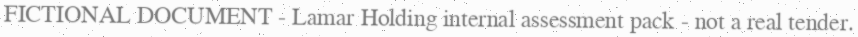 | FICTIONAL DOCUMENT - Lamar Holding internal assessment pack - not a real tender. |  |

## How to approve or correct

1. Correct `curation/readings/VOL-IV-p6-r1.yaml` directly if anything is wrong, including adding or removing uncertainties.
2. When it is right, record your approval yourself: `python -m tenderpack approve VOL-IV-p6-r1 --reviewer "Your Name"`. It refuses placeholder names, re-detects the region from the source PDF, re-runs the checks, and appends to `curation/approvals.yaml` your name, today's date and the review subject sha256 above. The program never writes an approval by itself.
3. Re-run `python -m tenderpack ingest`. Any later change to the reading, its uncertainties, the source PDF, the region's position or the image makes the reading pending again.
